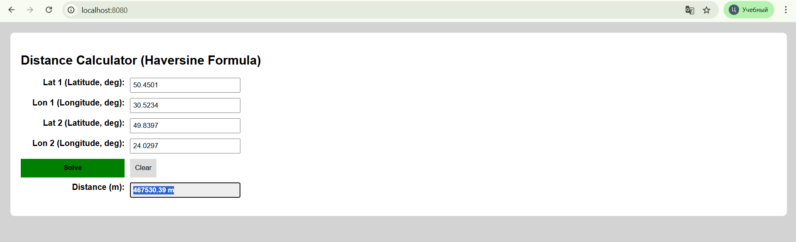

# jsp
# Task 5 – Distance Calculator (Haversine Formula)
 
Web-застосунок на JSP/Servlet для обчислення відстані між двома географічними точками за формулою Гаверсинуса.
 
## Вимоги
 
- Java 11 (`openjdk-11-jdk`)
- Apache Maven 3.8+
## Запуск
 
```bash
export JAVA_HOME=/usr/lib/jvm/java-11-openjdk-amd64
export PATH=$JAVA_HOME/bin:$PATH
 
mvn clean package tomcat7:run-war
```
 
Після запуску відкрити у браузері: [http://localhost:8080](http://localhost:8080)
 
## Використання
 
Введіть координати двох точок (широта і довгота в градусах) і натисніть **Solve**.
 
**Приклад – Київ → Львів:**
 
| Поле | Значення |
|------|----------|
| Lat 1 | 50.4501 |
| Lon 1 | 30.5234 |
| Lat 2 | 49.8397 |
| Lon 2 | 24.0297 |
 
Результат: ~467 530 м
 
## Скріншот
 

